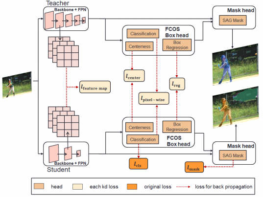

# [CenterMask KD](https://arxiv.org/abs/1911.06667) : Apply Knowledge Distillation on CenterMask (Instance Segmentation)




## Abstract

Deep learning has become one of the emerging research fields. In deep learning, many applications are expected to apply on edge computing devices or mobile devices. However, due to the intrinsic nature of deep neural network, numerous parameters and calculations make it difficult for real-time performance on edge devices. Therefore, we need to compress the neural network, and simultaneously maintain the neural network at a certain performance. Among many model compression methods, we chose to use knowledge distillation as our method. It is applied to the task of instance segmentation to improve the accuracy of lightweight models with relatively fewer parameters than its original one. In the experiment, we can find that our method is very effective for improving the performance of the model and thus reveal the feasibility for real-time applications.

### Environment
- V100 GPU
- CUDA 9.0 
- cuDNN 7.5.1 
- python 3.5
- pytorch 1.1.0 [wheel file](https://download.pytorch.org/whl/cu90/torch-1.1.0-cp35-cp35m-linux_x86_64.whl)
- torchvision 0.3.0 [wheel file](https://download.pytorch.org/whl/cu90/torchvision-0.3.0-cp35-cp35m-manylinux1_x86_64.whl)
- Implemented on [CenterMask](https://github.com/youngwanLEE/CenterMask)  

## Installation
Check [INSTALL.md](INSTALL.md) for installation instructions which is orginate from [CenterMask](https://github.com/youngwanLEE/CenterMask).

## Dataset
This implementation has been tested on the [MSCOCO](https://cocodataset.org/#download) dataset.
```bash
# COCO dataset
   coco
     ├─ annotations
     │   ├─ instances_train2017.json
     │   ├─ instances_val2017.json
     │   ├─ image_info_test-dev2017.json
     │   └─ ...
     └─ images
         ├─ 000000000529.jpg
         ├─ 000000401299.jpg
         ├─ 000000388903.jpg
         └─ ... 
```
         
## Training
Modify basic training setting in [train_net.py](tools/train_net.py) [``main()``](https://github.com/yuchieh0710/centermask_good/blob/master/tools/train_net.py#L142)

```bash
python tools/train_net.py  
```

## Evaluation

After training, you can evaluate your model in [test_net.py](tools/test_net.py) and visualize in [centermask_demo.py](demo/centermask_demo.py).
Change trained weight path in config you choose. 
You can download trained weight here [GoogleDrive weight download](https://drive.google.com/drive/u/2/folders/1VOQwtSQHvwl4fsPACjuWErZFv06RdhWs).

##### For single-gpu evaluation 
The results of test-dev can upload json file on [box result](https://competitions.codalab.org/competitions/20794#participate-get-data) & [segm result](https://competitions.codalab.org/competitions/20796#participate-get-data)
```bash
python tools/test_net.py --config-file "configs/centermask/centermask_V_19_eSE_FPN_lite_res600_ms_bs16_4x.yaml" 
```

##### For single-gpu visualize 
```bash
python demo/centermask_demo.py --config-file "configs/centermask/centermask_V_19_eSE_FPN_lite_res600_ms_bs16_4x.yaml"  --weights "tools/checkpoints/student/model_0360000.pth"  --input "demo/test_image"  --output_dir "demo/results/test_result"
The visualize result will under 'demo/demo/results/'
```
